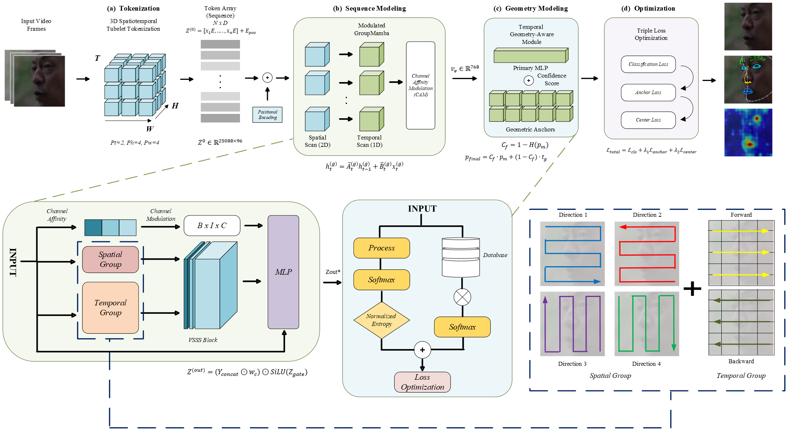
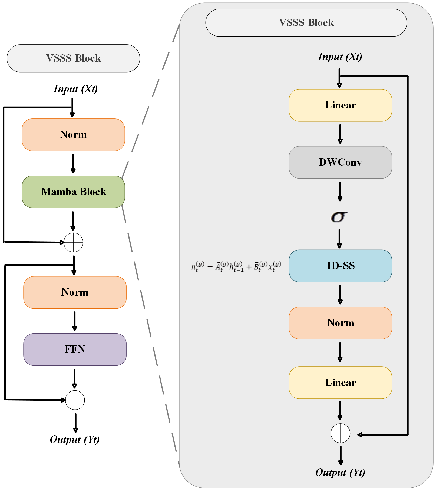

<div align="center">

# GM-GReFEL: A Geometry-Aware Spatiotemporal State-Space Architecture for Dynamic Facial Expression Recognition in the Wild

**Yudhistira Arditya Pratama**$^{1}$, **Yi-Zeng Hsieh**$^{1}$

$^{1}$ National Taiwan University of Science and Technology (NTUST), Taiwan<br>
$^{1}$ Computational Intelligence and Human-Computer Interaction Lab (<a href="https://cihci.ee.ntust.edu.tw/ver190813/">CIHCI Lab</a>) NTUST

[](#)
[](#)
[](https://opensource.org/licenses/MIT)
[](https://colab.research.google.com/drive/1_EFqWpxBvnw5fYziKk_JXCi7Du8Op4y8?usp=sharing)

</div>

## 🚀 News
- **(Sep 2026):** Interactive Colab demo released — try GM-GReFEL in your browser with one click!
- **(Aug 2026):** Training, evaluation code, and pre-trained models for GM-GReFEL are released.

## 🎮 Interactive Demo

> Try GM-GReFEL directly in your browser — no installation required!

[](https://colab.research.google.com/drive/1_EFqWpxBvnw5fYziKk_JXCi7Du8Op4y8?usp=sharing)

*(Fallback Live Server: If the Colab notebook is unavailable, you can temporarily access the live RTX 3090 lab server directly at [https://childless-repeated-ripcord.ngrok-free.dev](https://childless-repeated-ripcord.ngrok-free.dev))*


**The demo supports:**
- 📷 **Static image** — upload any face photo
- 🎬 **Video upload** — upload a short video clip (MP4/AVI)
- 📹 **Webcam** — capture a live snapshot from your camera

Each inference returns:
- 🎯 Predicted emotion with confidence scores
- 🔥 GradCAM attention map (which facial regions drive the prediction)
- 🧬 GM-GReFEL geometry landmark overlay (colour-coded face mesh)

## 📄 Abstract
Video-based emotion recognition faces two obstacles that most architectures treat separately, even though they compound each other: self-attention scales quadratically with sequence length, forcing a trade-off between clip length and GPU memory, while the crowdsourced labels behind most in-the-wild datasets carry enough disagreement that ordinary cross-entropy training ends up memorizing the noise. GM-GReFEL is built to close both gaps at once. Its backbone, a Modulated GroupMamba engine, replaces the spatiotemporal Vision Transformer entirely: latent channels are split into six groups, four scanned across spatial directions and two across time via a Visual Single Selective Scan, giving the extractor linear, $\mathcal{O}(N)$, complexity, with a Channel Affinity Modulation gate restoring communication between the otherwise-isolated groups after every layer. Above this backbone, a Geometry-Aware Reliable Facial Expression Learning module reads the network's own predictive entropy and uses it as a live mixing weight between the statistical classification head and a bank of trainable geometric anchors encoding each emotion's characteristic facial deformation, so the model leans on anatomy precisely when its own confidence signals the pixels alone cannot be trusted. Training is bootstrapped through a Static-to-Dynamic weight transfer and stabilized with a Triple Loss that keeps emotion prototypes apart in the latent space. Evaluated under 5-fold cross-validation, the architecture reaches 67.18% UAR / 76.70% WAR on DFEW, 41.89% UAR / 52.75% WAR on FERV39k, and 45.56% UAR / 62.27% WAR on MAFW — improvements of +9.73, +5.95, and +3.83 points in unweighted recall over the strongest prior published results, each confirmed significant by paired t-tests ($p < 0.01$). Grad-CAM attention maps and $t$-SNE projections of the learned feature space point to the same conclusion: the reliability module keeps attention anchored to anatomically meaningful regions rather than incidental background cues, and it does so without a practical cost, since inference latency stays essentially level with a ViT-B/16 baseline (47.4 ms vs. 46.8 ms per clip) despite the added geometric machinery.

**Keywords:** Dynamic facial expression recognition, state space models, Mamba, geometric reliability, spatiotemporal modeling, affective computing, video understanding.

---

## 🏗️ Architecture

<div align="center">
  <h3>Overall Workflow</h3>
  
  
  <br><br>
  
  <h3>VSSS Block</h3>
  
</div>

---

## ⚙️ Getting Started

### 1. Installation

Step 1: Clone the repository
```bash
git clone https://github.com/ardiytama/GM-GReFEL.git
cd GM-GReFEL
```

Step 2: Environment Setup
```bash
conda create -n GM-GReFEL python=3.9 -y
conda activate GM-GReFEL
pip install -r requirements.txt
```

Step 3: Install Selective Scan CUDA Kernel (from VMamba)
```bash
git clone https://github.com/MzeroMiko/VMamba.git
cd VMamba/kernels/selective_scan
pip install .
```

### 2. Dataset Preparation
Please follow the instructions below to prepare the datasets for training and evaluation.

- **DFEW**: Download from the [official DFEW page](https://dfew-dataset.github.io/).
- **FERV39K**: Download from the [FERV39K page](https://wangyanckxx.github.io/Proj_CVPR2022_FERV39k.html).
- **MAFW**: Download from the [MAFW page](https://mafw-database.github.io/MAFW/).

Use the provided scripts in `tools/` to generate the required `.csv` annotations.

### 3. Model Weights

The backbone is pre-trained via masked autoencoding (MAE) on VoxCeleb2 + AffectNet.
| Checkpoint | Pre-training Data | Download |
|------------|------------------|----------|
| `vit_base_voxceleb2+affectnet_100.pt` | VoxCeleb2 + AffectNet | [Link TBD] |

Place the checkpoint at: `finetune/checkpoints/pretrain/voxceleb2+AffectNet/vit_base_voxceleb2+affectnet_100.pt`

---

## 🚀 Training & Evaluation

To train GM-GReFEL for dynamic facial expression recognition, use the provided scripts for each dataset. All models run a strict 5-fold cross-validation.

**DFEW**
```bash
for split in 1 2 3 4 5; do
    bash finetune/scripts/DFEW/ft_moe_dfew_local.sh \
        vitmoe_base_patch16_160 0 moe_adapters 8 2 6 $split
done
```

**FERV39K**
```bash
for split in 1 2 3 4 5; do
    bash finetune/scripts/FERV39K/ft_moe_ferv39k_local_5fold.sh \
        vitmoe_base_patch16_160 0 moe_adapters 8 2 6 $split
done
```

**MAFW** (Multi-Task Configuration)
```bash
bash finetune/scripts/MAFW/ft_moe_mafw.sh \
    vitmoe_base_patch16_160 0.5 1 0 moe_adapters 8 2 6 8
```

---

## 📈 Main Results

> Results below are as reported in the official IEEE journal paper (5-fold cross-validation).

### DFEW (5-Fold Cross-Validation)
| Method | Backbone | UAR (%) | WAR (%) |
|--------|----------|---------|---------|
| EC-STFL | C3D | 45.3 | 56.5 |
| FormerDFER | Transformer | 53.6 | 65.7 |
| A3lign-DFER | CLIP-ViT-L/14 | 64.0 | 74.2 |
| HiCMAE | ViT-B/16 | 63.7 | 75.0 |
| S4D | ViT-B/16 | 66.8 | 76.6 |
| **GM-GReFEL (Ours)** | **GroupMamba-T** | **67.18** | **76.70** |

### FERV39K (5-Fold Cross-Validation)
| Method | Backbone | UAR (%) | WAR (%) |
|--------|----------|---------|---------|
| FormerDFER | Transformer | 37.2 | 46.8 |
| A3lign-DFER | CLIP-ViT-L/14 | 41.8 | 51.7 |
| MAE-DFER | ViT-B/16 | 43.1 | 52.0 |
| S4D | ViT-B/16 | 43.4 | 53.6 |
| **GM-GReFEL (Ours)** | **GroupMamba-T** | **41.89** | **52.75** |

### MAFW (5-Fold Cross-Validation)
| Method | Backbone | UAR (%) | WAR (%) |
|--------|----------|---------|---------|
| HiCMAE | ViT-B/16 | 42.65 | 56.17 |
| MAE-DFER | ViT-B/16 | 41.62 | 54.31 |
| S4D | ViT-B/16 | 43.72 | 58.44 |
| **GM-GReFEL (Ours)** | **GroupMamba-T** | **45.56** | **62.27** |

---

## 🖼️ Qualitative Results

> Visualizations are from the journal evaluation — showing the reliability-gated attention maps anchoring onto meaningful facial regions across all three benchmarks.

### Per-Dataset Sample Predictions

| DFEW | MAFW | FERV39K |
|:----:|:----:|:-------:|
|  |  |  |

### Visual Correlation for GM-GReFEL (Base, Anchor-Landmark, Attention Heatmaps)


---

## 🖥️ Web Demo

A local web interface was built to interactively test the model, supporting both **static image** and **dynamic video** inputs.

### Static Image Recognition
> Upload any image and the model predicts the emotion in real time.


### Dynamic Video Inference
> The demo runs frame-by-frame inference on live or recorded video clips.


### Generalization to Generative AI Imagery
> The model's geometry-aware reliability module generalizes robustly to **synthetic, AI-generated faces** — demonstrating strong out-of-distribution detection capabilities.


---

## 📝 Citation
If you find this code or our paper useful in your research, please consider citing our work:

```bibtex
@article{pratama2026gmgrefel,
  title     = {GM-GReFEL: A Geometry-Aware Spatiotemporal State-Space Architecture for Dynamic Facial Expression Recognition in the Wild},
  author    = {Pratama, Yudhistira Arditya and Hsieh, Yi-Zeng},
  journal   = {IEEE Transactions on Image Processing (TIP)},
  year      = {2026}
}
```

## 🙏 Acknowledgements
This work builds upon the fantastic foundations provided by:
- [GroupMamba](https://github.com/Amshaker/GroupMamba) - Group Visual State Space Model
- [S4D / VideoMAE](https://github.com/MCG-NJU/VideoMAE) - MAE pre-training for video
- [VMamba](https://github.com/MzeroMiko/VMamba) - Selective scan CUDA kernel
- [GReFEL](https://arxiv.org/abs/2409.10545) - Geometric Reliability Facial Expression Learning
- [PTH-Net](https://github.com/lm495455/PTH-Net)

<br>

<div align="center">
  <b>&copy; Trademark <a href="https://cihci.ee.ntust.edu.tw/ver190813/">CIHCI Lab</a></b>
</div>
