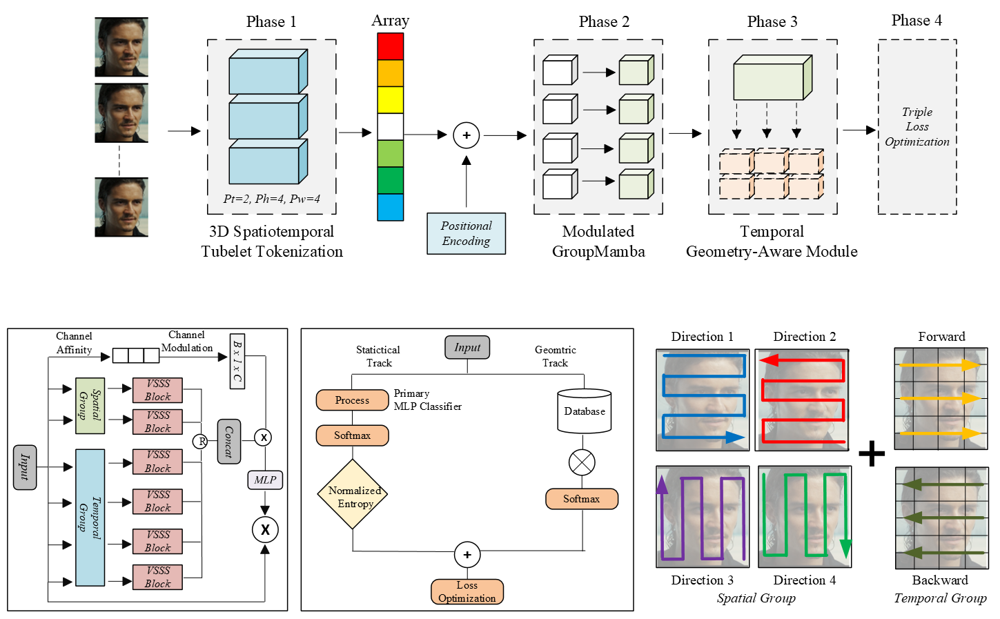
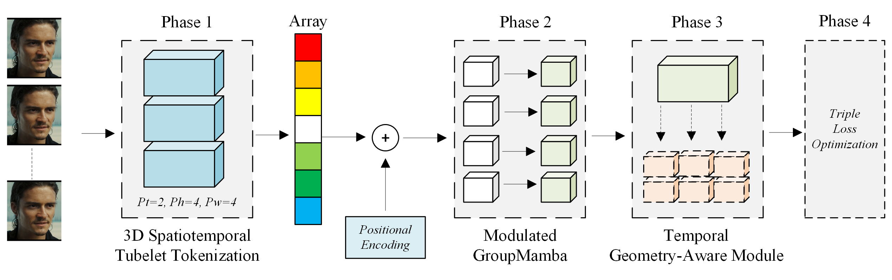
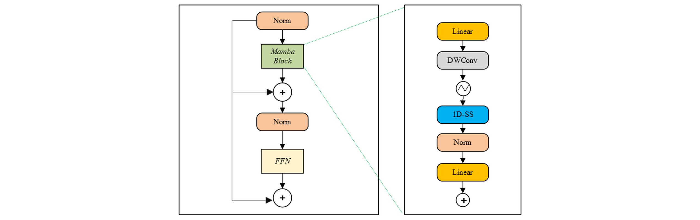

<div align="center">

# GM-GReFEL: A Geometry-Aware Spatiotemporal State-Space Architecture for Dynamic Facial Expression Recognition in the Wild

**Yudhistira Arditya Pratama**$^{1}$, **Yi-Zeng Hsieh**$^{1}$

$^{1}$ National Taiwan University of Science and Technology (NTUST), Taiwan

[](#)
[](#)
[](https://opensource.org/licenses/MIT)

</div>

## 🚀 News
- **(Aug 2026):** Training, evaluation code, and pre-trained models for GM-GReFEL are released.

## 📄 Abstract
Recognizing emotion from continuous, unconstrained video is bottlenecked by two compounding problems: the quadratic memory cost of self-attention over long facial sequences, and the severe label ambiguity of crowdsourced "in-the-wild" datasets. This paper introduces GM-GReFEL, a Geometry-Aware Reliable Spatiotemporal State-Space Model that addresses both simultaneously. In place of a spatiotemporal Vision Transformer, the feature extractor is built around a Modulated GroupMamba engine that partitions latent channels into six orthogonal groups and applies a Visual Single Selective Scan (VSSS) independently along four spatial directions and two temporal directions, achieving strict $\mathcal{O}(N)$ complexity in sequence length; a Channel Affinity Modulation (CAM) gate re-couples these pathways after every layer. On top of this backbone, a Geometry-Aware Reliable Facial Expression Learning (GReFEL) module estimates the normalized Shannon entropy of the network's own prediction and blends it, in proportion to that uncertainty, with a cosine-similarity vote against trainable geometric anchors encoding idealized facial deformations for each emotion class. A decoupled Static-to-Dynamic (S2D) transfer scheme inflates pre-trained 2D weights into the 3D tubelet embedding, and a Triple Loss objective keeps emotion prototypes separated in the latent space. Under strict 5-fold cross-validation, GM-GReFEL attains 67.18% UAR / 76.70% WAR on DFEW, 41.89% UAR / 52.75% WAR on FERV39k, and 45.56% UAR / 62.27% WAR on MAFW, raising the previous unweighted-recall ceilings by +9.73, +5.95, and +3.83 points respectively, with every gain confirmed significant by paired $t$-tests ($p<0.01$). Grad-CAM and $t$-SNE analysis confirm that the reliability module anchors attention to physically meaningful facial regions, while a direct hardware comparison shows inference latency matching a ViT-B/16 baseline (47.4 ms vs. 46.8 ms) despite the added geometric machinery.

**Keywords:** Dynamic facial expression recognition, state space models, Mamba, geometric reliability, spatiotemporal modeling, affective computing, video understanding.

---

## 🏗️ Architecture

### Overall Workflow


### Detailed Architecture
<div align="center">
  
</div>

### VSSS Block
<div align="center">
  
</div>

---

## ⚙️ Getting Started

### 1. Installation

Step 1: Clone the repository
```bash
git clone https://github.com/ardiytama/GM-GReFEL.git
cd GM-GReFEL
```

Step 2: Environment Setup
```bash
conda create -n GM-GReFEL python=3.9 -y
conda activate GM-GReFEL
pip install -r requirements.txt
```

Step 3: Install Selective Scan CUDA Kernel (from VMamba)
```bash
cd kernels/selective_scan && pip install .
```

### 2. Dataset Preparation
Please follow the instructions below to prepare the datasets for training and evaluation.

- **DFEW**: Download from the [official DFEW page](https://dfew-dataset.github.io/).
- **FERV39K**: Download from the [FERV39K page](https://wangyanckxx.github.io/Proj/CVPR2022_FERV39k.html).
- **MAFW**: Download from the [MAFW page](https://mafw-database.github.io/MAFW/).

Use the provided scripts in `tools/` to generate the required `.csv` annotations.

### 3. Model Weights

The backbone is pre-trained via masked autoencoding (MAE) on VoxCeleb2 + AffectNet.
| Checkpoint | Pre-training Data | Download |
|------------|------------------|----------|
| `vit_base_voxceleb2+affectnet_100.pt` | VoxCeleb2 + AffectNet | [Link TBD] |

Place the checkpoint at: `finetune/checkpoints/pretrain/voxceleb2+AffectNet/vit_base_voxceleb2+affectnet_100.pt`

---

## 🚀 Training & Evaluation

To train GM-GReFEL for dynamic facial expression recognition, use the provided scripts for each dataset. All models run a strict 5-fold cross-validation.

**DFEW**
```bash
for split in 1 2 3 4 5; do
    bash finetune/scripts/DFEW/ft_moe_dfew_local.sh \
        vitmoe_base_patch16_160 0 moe_adapters 8 2 6 $split
done
```

**FERV39K**
```bash
for split in 1 2 3 4 5; do
    bash finetune/scripts/FERV39K/ft_moe_ferv39k_local_5fold.sh \
        vitmoe_base_patch16_160 0 moe_adapters 8 2 6 $split
done
```

**MAFW** (Multi-Task Configuration)
```bash
bash finetune/scripts/MAFW/ft_moe_mafw.sh \
    vitmoe_base_patch16_160 0.5 1 0 moe_adapters 8 2 6 8
```

---

## 📈 Main Results

### DFEW (5-Fold Cross-Validation)
| Method | Backbone | UAR (%) | WAR (%) |
|--------|----------|---------|---------|
| EC-STFL | C3D | 45.3 | 56.5 |
| FormerDFER | Transformer | 53.6 | 65.7 |
| A3lign-DFER | CLIP-ViT-L/14 | 64.0 | 74.2 |
| HiCMAE | ViT-B/16 | 63.7 | 75.0 |
| S4D | ViT-B/16 | 66.8 | 76.6 |
| **GM-GReFEL (Ours)** | **GroupMamba-T** | **67.18** | **76.70** |

### FERV39K (5-Fold Cross-Validation)
| Method | Backbone | UAR (%) | WAR (%) |
|--------|----------|---------|---------|
| FormerDFER | Transformer | 37.2 | 46.8 |
| A3lign-DFER | CLIP-ViT-L/14 | 41.8 | 51.7 |
| MAE-DFER | ViT-B/16 | 43.1 | 52.0 |
| S4D | ViT-B/16 | 43.4 | 53.6 |
| **GM-GReFEL (Ours)** | **GroupMamba-T** | **41.89** | **52.75** |

### MAFW (5-Fold Cross-Validation)
| Method | Backbone | UAR (%) | WAR (%) |
|--------|----------|---------|---------|
| HiCMAE | ViT-B/16 | 42.65 | 56.17 |
| MAE-DFER | ViT-B/16 | 41.62 | 54.31 |
| S4D | ViT-B/16 | 43.72 | 58.44 |
| **GM-GReFEL (Ours)** | **GroupMamba-T** | **45.56** | **62.27** |

---

## 📝 Citation
If you find this code or our paper useful in your research, please consider citing our work:

```bibtex
@article{pratama2026gmgrefel,
  title     = {GM-GReFEL: A Geometry-Aware Spatiotemporal State-Space Architecture for Dynamic Facial Expression Recognition in the Wild},
  author    = {Pratama, Yudhistira Arditya and Hsieh, Yi-Zeng},
  journal   = {IEEE Transactions on Image Processing (TIP)},
  year      = {2026}
}
```

## 🙏 Acknowledgements
This work builds upon the fantastic foundations provided by:
- [GroupMamba](https://github.com/Amshaker/GroupMamba) - Group Visual State Space Model
- [S4D / VideoMAE](https://github.com/MCG-NJU/VideoMAE) - MAE pre-training for video
- [VMamba](https://github.com/MzeroMiko/VMamba) - Selective scan CUDA kernel
- [GReFEL](https://arxiv.org/abs/2409.10545) - Geometric Reliability Facial Expression Learning
